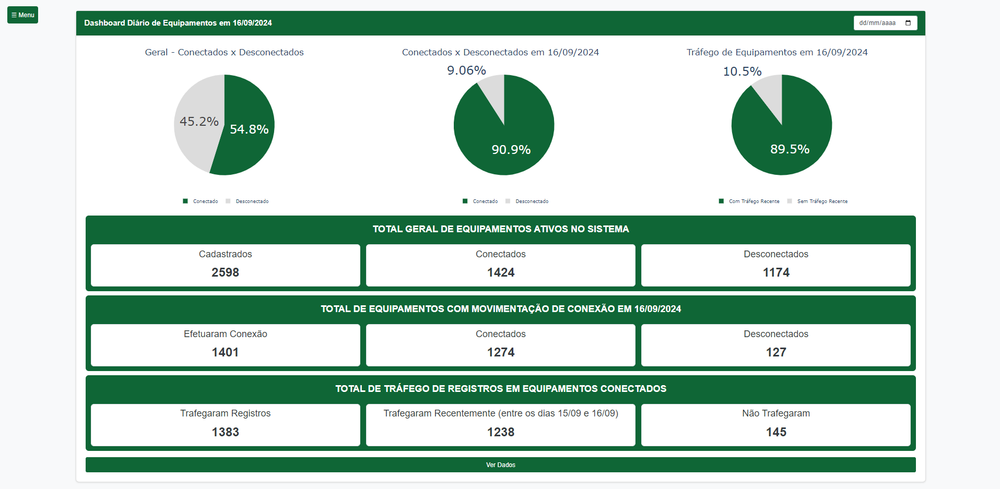
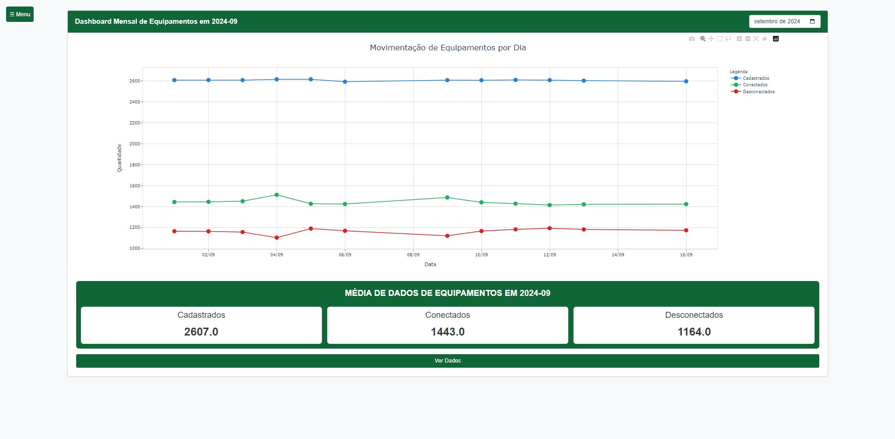
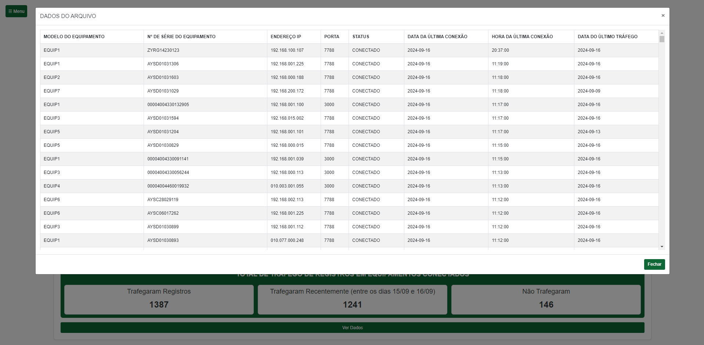


# Dashboard de Monitoramento de Equipamentos

Este projeto é um dashboard web desenvolvido com Flask para monitorar o status de conexão e tráfego de equipamentos. Ele fornece visualizações em tempo real e análises históricas baseadas em dados armazenados em um banco de dados MySQL.

## Funcionalidades

- **Dashboard Diário**: Exibe estatísticas e gráficos com possibilidade de filtro por dia, incluindo:
  - Total de equipamentos cadastrados
  - Número de equipamentos conectados e desconectados
  - Gráfico de pizza mostrando a proporção de equipamentos conectados vs. desconectados
  - Detalhes sobre o tráfego de dados recente




- **Dashboard Mensal**: Fornece uma visão geral mensal com:
  - Gráfico de linha mostrando a movimentação diária de equipamentos
  - Médias mensais de equipamentos cadastrados, conectados e desconectados



- **Tabela de Dados**: Exibe informações detalhadas sobre cada equipamento, incluindo:
  - Modelo do equipamento
  - Número de série
  - Endereço IP e porta
  - Status de conexão
  - Data e hora da última conexão
  - Data do último tráfego de dados
  
  


## Tecnologias Utilizadas

- **Backend**: Python com Flask
- **Frontend**: HTML, CSS e JavaScript (com Plotly para gráficos interativos)
- **Banco de Dados**: MySQL
- **Bibliotecas Python**:
  - **pandas:** para manipulação e análise de dados
  - **plotly**: para criação de gráficos interativos
  - **mysql-connector**: para conexão com o banco de dados MySQL

## Configuração e Instalação

1. Clone o repositório:
   ```
   git clone [URL_DO_REPOSITORIO]
   ```

2. Instale as dependências:
   ```
   pip install -r requirements.txt
   ```

3. Crie a estrutura do banco de dados usando o arquivo [database-dashboard.sql](./database/database-dashboard.sql)

4. Após criar o banco, execute os inserts presentes no arquivo [inserts.sql](./database/inserts.sql)

5. Configure as credenciais do banco de dados no arquivo `Dashboard.py`:
   ```python
   db_config = {
       'host': 'localhost',
       'user': 'seu_usuario',
       'password': 'sua_senha',
       'database': 'dados_dashboard',
       'port': 3317
   }
   ```

6. Execute a aplicação:
   ```
   python Dashboard.py
   ```

7. Acesse o dashboard em `http://localhost:5000`

## Estrutura do Projeto

- `Dashboard.py`: Arquivo principal contendo a lógica da aplicação Flask
- `template/`: Diretório contendo os templates HTML
  - `index.html`: Template para o dashboard diário
  - `dashboard-mensal.html`: Template para o dashboard mensal

## Uso

- A página inicial (`/`) exibe o dashboard diário
- O dashboard mensal pode ser acessado em `/dashboard-mensal`
- Use os seletores de data para navegar entre diferentes dias ou meses


## Explicação de Partes Relevantes

### 1. Importações e Configuração Inicial

```python
from flask import Flask, render_template, redirect, url_for, request
import pandas as pd
import plotly.express as px
import plotly.io as pio
import mysql.connector
from mysql.connector import Error
from datetime import datetime, timedelta
import os

app = Flask(__name__, template_folder='./template')
```

- `Flask`: Framework web utilizado para criar a aplicação.
- `render_template`: Função para renderizar templates HTML.
- `redirect` e `url_for`: Utilizados para redirecionamento entre rotas.
- `request`: Permite acessar dados de requisições HTTP.
- `pandas`: Biblioteca para manipulação e análise de dados.
- `plotly.express` e `plotly.io`: Utilizados para criar e renderizar gráficos interativos.
- `mysql.connector`: Biblioteca para conectar e interagir com o banco de dados MySQL.
- `datetime`: Para manipulação de datas e horas.

A aplicação Flask é inicializada com o diretório de templates definido como './template'.

### 2. Configuração do Banco de Dados

```python
db_config = {
    'host': 'localhost',            # SEU HOST 
    'user': '',                     # SEu USUÁRIO
    'password': '',                 # SUA SENHA
    'database': 'dados_dashboard',  # NOME DO BANCO CRIADO
    'port': 3306                    # PORTA PADRÃO, MUDE CASO NECESSÁRIO
}
```

Esta configuração define os parâmetros de conexão com o banco de dados MySQL. Em um ambiente de produção, essas informações deveriam ser armazenadas de forma segura, como em variáveis de ambiente.

### 3. Funções de Utilidade

#### 3.1 Criação de Conexão com o Banco de Dados

```python
def create_connection():
    try:
        connection = mysql.connector.connect(**db_config)
        if connection.is_connected():
            return connection
    except Error as e:
        print(f"Erro ao conectar ao banco de dados: {e}")
    return None
```

Esta função tenta estabelecer uma conexão com o banco de dados MySQL usando os parâmetros definidos em `db_config`. Se bem-sucedida, retorna o objeto de conexão. Caso contrário, imprime uma mensagem de erro e retorna `None`.

#### 3.2 Busca de Dados

```python
def fetch_data(query, params=None):
    connection = create_connection()
    if connection:
        try:
            df = pd.read_sql(query, connection, params=params)
        except Error as e:
            print(f"Erro ao executar consulta: {e}")
            df = pd.DataFrame()
        finally:
            connection.close()
    else:
        df = pd.DataFrame()
    return df
```

Esta função executa uma consulta SQL no banco de dados e retorna os resultados como um DataFrame do pandas. Ela gerencia a abertura e fechamento da conexão, e trata possíveis erros, retornando um DataFrame vazio em caso de falha.

#### 3.3 Geração de HTML para Tabela de Dados

```python
def generate_data_html(df, actual_date):
    rows_html = ""
    for _, row in df.iterrows():
        row_date = row['dataUltimaConexao'].date() if isinstance(row['dataUltimaConexao'], pd.Timestamp) else row['dataUltimaConexao']
        date_class = "bg-warning" if row_date != actual_date else ""
        
        if isinstance(row['horaUltimaconexao'], pd.Timedelta):
            hora_formatada = str(row['horaUltimaconexao']).split(' ')[-1]
        else:
            hora_formatada = row['horaUltimaconexao']
        
        row_html = f"""
        <tr class="{date_class}">
            <td>{row['cliente']}</td>
            <td>{row['modeloEquip']}</td>
            <td>{row['numSerieEquip']}</td>
            <td>{row['ipEquip']}</td>
            <td>{row['portaEquip']}</td>
            <td>{row['statusEquip']}</td>
            <td>{row['dataUltimaConexao']}</td>
            <td>{hora_formatada}</td>
            <td>{row['ultimoNsr']}</td>
            <td>{row['dataUltimoRegistro']}</td>
        </tr>
        """
        rows_html += row_html

    data_html = f"""
    <table class="table table-striped table-bordered">
        <thead>
            <tr>
                <th>Nome do Cliente</th>
                <th>Modelo do equipamento</th>
                <th>N° de série do equipamento</th>
                <th>Endereço IP</th>
                <th>Porta</th>
                <th>Status</th>
                <th>Data da última conexão</th>
                <th>Hora da última conexão</th>
                <th>Último NSR</th>
                <th>Data do último registro</th>
            </tr>
        </thead>
        <tbody>
            {rows_html}
        </tbody>
    </table>
    """
    return data_html
```

Esta função gera o HTML para a tabela de dados dos equipamentos. Ela itera sobre cada linha do DataFrame, formatando os dados e aplicando classes CSS conforme necessário (por exemplo, destacando datas diferentes da atual).

### 4. Rotas e Lógica Principal

#### 4.1 Rota Principal (Dashboard Diário)

```python
@app.route('/')
def index():
    selected_date = request.args.get('selected_date', default=pd.Timestamp.now().strftime('%Y-%m-%d'), type=str)
    actual_date = pd.to_datetime(selected_date).date()
    previous_date = actual_date - timedelta(days=1)
    
    # ... (código para formatação de datas)

    geral_query = """
    SELECT cliente, modeloEquip, numSerieEquip, ipEquip, portaEquip, statusEquip, dataUltimaConexao, horaUltimaconexao, ultimoNsr, dataUltimoRegistro
    FROM dados
    WHERE criacaoInsert = %s
    ORDER BY dataUltimaConexao DESC, horaUltimaconexao DESC, dataUltimoRegistro DESC
    """
    geral_params = (actual_date,)
    df = fetch_data(geral_query, params=geral_params)

    # ... (várias consultas SQL para obter estatísticas)

    # Criação de gráficos
    fig_all = px.pie(
        df,
        names='statusEquip',
        title='Geral - Conectados x Desconectados',
        color='statusEquip',
        color_discrete_map=color_map_geral,
    )
    # ... (configurações adicionais do gráfico)

    graph_html_all = pio.to_html(fig_all, full_html=False)

    # ... (criação de outros gráficos)

    data_html = generate_data_html(df, actual_date)

    return render_template('index.html',
                           graph_html_all=graph_html_all,
                           graph_html_today=graph_html_today,
                           graph_html_travel=graph_html_travel,
                           data_html=data_html,
                           # ... (outros parâmetros)
                           )
```

Esta rota gera o dashboard diário. Ela:
1. Obtém a data selecionada (ou usa a data atual como padrão).
2. Executa várias consultas SQL para obter dados e estatísticas.
3. Cria gráficos usando plotly.express.
4. Gera o HTML para a tabela de dados.
5. Renderiza o template 'index.html' com todos os dados e gráficos.

#### 4.2 Dashboard Mensal

```python
@app.route('/dashboard-mensal')
def dashboard_mensal():
    selected_month = request.args.get('month', default=pd.Timestamp.now().strftime('%Y-%m'), type=str)
    year, month = map(int, selected_month.split('-'))

    # ... (várias consultas SQL para dados mensais)

    # Criação do gráfico de linha
    fig = px.line(
        df_combined,
        x='Data',
        y=['Cadastrados', 'Conectados', 'Desconectados'],
        labels={'value': 'Quantidade', 'Data': 'Data'},
        title='Movimentação de Equipamentos por Dia',
        markers=True,
        color_discrete_map=color_map_mensal,
    )
    # ... (configurações adicionais do gráfico)

    conn_line_html = pio.to_html(fig, full_html=False)

    return render_template('dashboard-mensal.html',
                           conn_line_html=conn_line_html,
                           # ... (outros parâmetros)
                           )
```

Esta rota gera o dashboard mensal. Ela:
1. Obtém o mês selecionado.
2. Executa consultas SQL para obter dados agregados por mês.
3. Cria um gráfico de linha mostrando a movimentação diária de equipamentos.
4. Renderiza o template 'dashboard-mensal.html' com os dados e o gráfico.

### 5. Rotas de Atualização

```python
@app.route('/update_date', methods=['POST'])
def update_date():
    selected_date = request.form.get('date')
    return redirect(url_for('index', selected_date=selected_date))

@app.route('/update_month', methods=['POST'])
def update_month():
    selected_month = request.form.get('month')
    return redirect(url_for('dashboard_mensal', month=selected_month))
```

Estas rotas permitem a atualização da data ou mês selecionado nos dashboards. Elas recebem dados de um formulário POST e redirecionam para a página apropriada com os novos parâmetros.

### 6. Execução da Aplicação

```python
if __name__ == '__main__':
    app.run(debug=True)
```

Este trecho final verifica se o script está sendo executado diretamente (não importado como um módulo) e, em caso afirmativo, inicia o servidor Flask em modo de debug.

## Considerações Finais

Este código implementa um dashboard web complexo com várias funcionalidades:
- Visualização de dados diários e mensais.
- Geração dinâmica de gráficos baseados em dados do banco de dados.
- Interatividade para seleção de datas e meses específicos.
- Exibição detalhada de informações sobre equipamentos em uma tabela HTML.

O uso de Flask permite uma estrutura web leve e flexível, enquanto pandas e plotly fornecem poderosas capacidades de manipulação de dados e visualização. A interação com o banco de dados MySQL é gerenciada de forma eficiente, com tratamento de erros adequado.


